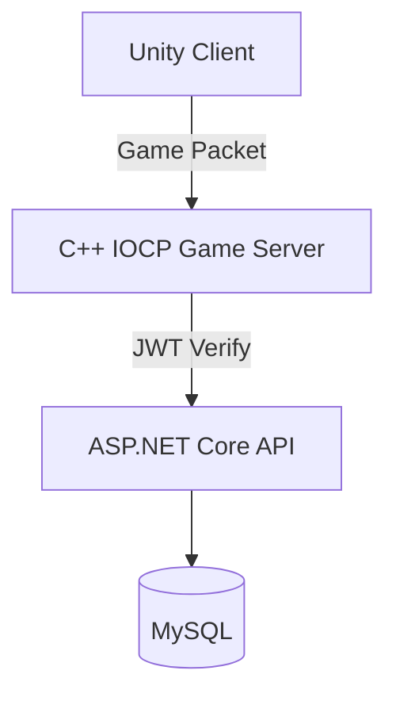

# RealTimeBattle

IOCP-based **C++ real-time multiplayer battle server**

This project is a **game server portfolio project** integrating:

- Unity Client
- C++ IOCP Game Server
- ASP.NET Core API Server
- MySQL Database

The project demonstrates **real-time networking, asynchronous I/O handling, and scalable server architecture**.

---

# Overview

The main goal of this project is to build a **high-performance real-time game server** using Windows IOCP.

The project also includes a **C# TCP Socket Server prototype**, which was implemented first and later refactored into the **C++ IOCP server**.

This allows comparison between:

- C# TCP socket server
- C++ IOCP server

in terms of **packet processing, performance, and architecture design**.

---

# Architecture

Components:

- **Unity Client**
  - Game logic
  - UI
  - Network packet send/receive

- **C++ IOCP Game Server**
  - Session management
  - Packet processing
  - Room-based battle logic

- **ASP.NET Core API Server**
  - Authentication
  - JWT token verification
  - Battle record storage

- **MySQL**
  - User data
  - Battle history

---

# Key Features

### IOCP-based Networking

- Windows **IO Completion Port**
- Asynchronous I/O handling
- High-performance socket processing

---

### Real-Time Game Loop

- Fixed **tick-based simulation**
- Deterministic state updates
- Packet-based state synchronization

---

### Room-Based Architecture

Each battle is processed inside a **dedicated room instance**.

Benefits:

- Isolated game state
- Simplified synchronization
- Scalable battle handling

---

### JWT Authentication

Login flow:

1. User login via API server
2. JWT token issued
3. Token verified by game server
4. Game session created

---

### Bot Load Testing

A **bot client tool** is implemented to simulate large-scale connections.

Features:

- Simulates multiple players
- Stress tests the IOCP server
- Measures response time and stability

---

# Load Test

Bot load testing was performed to evaluate server performance.

Example scenario:
Bot Count: 1000
Connection Interval: 50ms
Average Response Time: < 1ms
CPU Usage: under 5%

This test verifies that the IOCP server can handle **large numbers of concurrent sessions efficiently**.

---

# Packet Processing (C# Server)

The C# prototype server intentionally uses the following packet structure.

Packet Object → JSON → Byte (Send)
Byte → JSON → Packet Object (Recv)

Although JSON serialization is inefficient for real-time servers, it was used to:

- Compare packet processing methods
- Understand serialization overhead
- Prototype network features before migrating to C++

---

# Tech Stack

### Server

- C++
- Windows IOCP
- WinSock2

### Backend

- C#
- ASP.NET Core
- JWT Authentication

### Database

- MySQL
- Pomelo EF Core Provider

### Client

- Unity
- C#

---

# How to Run

## 1. C++ IOCP Server

Requirements:

- Visual Studio 2022
- x64 / Release

Default port: 7777

---

## 2. ASP.NET Core API Server
dotnet run

Default addresses: 
- http://localhost:5146 
- https://localhost:7170

---

## 3. Unity Client

In `SocketClient.cs`
CppConnect() or CSharpConnect()

Select the desired server and run the client.

---

## 4. Database

Configure database settings in: appsettings.json

Default configuration assumes a **local development environment**.

If the database is not prepared, some features such as:

- login
- battle record storage

may be limited.

---

# Game Scene Structure
- Boot
- Login
- Lobby
- Matching
- Battle
- Result

---

# Game Lifecycle

### Client Boot

- Initialize singleton managers
- Load configuration
- Move to Login Scene

---

### Login

- User login / registration
- JWT token issued

---

### Lobby

- Connect to socket server
- Verify JWT token
- Create game session

---

### Matching

- Wait for matchmaking completion
- Load player data
- Enter battle scene

---

### Battle

- Spawn players
- Synchronize game state using packets
- Process battle results

---

### Result

- Apply battle result locally
- Send record request to API server
- Close room asynchronously

---

# Notes

- Unity client variables follow **camelCase**
- C# backend follows **.NET conventions**
- C++ server follows **common C++ server coding practices**
